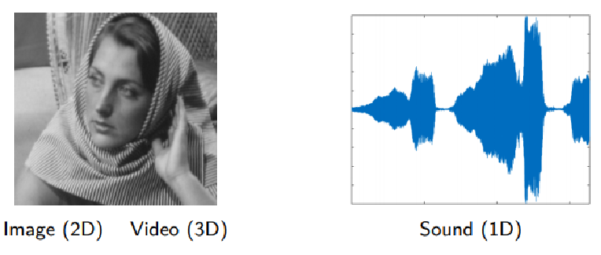

# Graph 介绍

## 引言

科学研究中并不是所有的数据都能够被转换到欧几里得空间中（eg：社交网络、信息网络等），导致无法有效地对这些数据进行处理。针对该问题，研究者们引入了图论中抽象意义上的图（Graph）来表示非欧几里得结构化数据。

本文首先分别介绍了欧几里得结构化数据和非欧几里得结构化数据特点，然后针对非欧几里得结构化数据的表示问题，引入了图论中抽象意义上的图（Graph）概念，并对图（Graph）中一些表示形式进行介绍，以帮助读者加深对图（Graph）的理解。

## 一、欧几里得结构化数据

### 1、欧几里得空间

欧几里德空间(Euclidean Space)，简称为欧氏空间(也可以称为平直空间)，在数学中是对欧几里德所研究的2维和3维空间的一般化。这个一般化把欧几里德对于距离、以及相关的概念长度和角度，转换成任意数维的坐标系。如下图所示。

> 图 a 表示二维欧几里得空间

> 图 b 表示三维欧几里得空间

### 2、 常见的欧几里得结构化数据

将数据转换到欧几里得空间中，所得到的数据称为**欧几里得结构化数据**。

常见的欧几里得结构化数据主要包含：

- 1D：声音，时间序列等；
- 2D：图像等；
- 3D：视频，高光谱图像等；

### 3、 欧几里得结构化的优点

对数据进行欧几里得结构化具有以下优点：

- 合并其他有用信息；
- 能够利用空间相关性；
- 利用几何假设来降低学习的复杂度;
- 对欧几里得结构化数据进行处理的操作都具有明确的定义和计算效率（eg：卷积操作→ 滤波器转换或快速傅里叶变换（FFT），下采样操作→ 从n中选择一个像素，非线性操作 → 逐点操作，池化操作 → 池化感受野等）。

## 二、非欧几里得结构化数据

### 1、非欧几里得空间

然而，科学研究中并不是所有的数据都能够被转换到欧几里得空间中（eg：社交网络、信息网络等），对于不能进行欧几里得结构化的数据，我们将其称为非欧几里得结构化数据。

### 2、 非常见的欧几里得结构化数据

常见的非欧几里得结构化数据主要包含：

- 1D：社交网络（eg：Facebook，Twitter等）等；
- 2D：生物网络（基因，分子，大脑连接）等；
- 3D：基础设施网络（eg：能源，交通，互联网，通信等）等；

## 三、图（Graph）

### 1、图（Graph）的引入

针对非欧几里得结构化数据表示问题，研究者们引入了图论中抽象意义上的图（Graph）来表示非欧几里得结构化数据。

### 2、图（Graph）的定义

图（Graph）定义形式为$\mathcal{G}=(\mathcal{V}, \mathcal{E})$，其结构如下图所示：

> $\mathcal{V}=\left\{v_{i} | i=1, \ldots, N\right\}$ 表示顶点或节点;
> 
> $\mathcal{E}=\left\{e_{i j} | v_{i}, v_{j} \in \mathcal{V}\right\},\|\mathcal{E}\| \leq N^{2}$ 表示顶点与顶点之间所连接的边；

### 3、图（Graph）的表示形式

#### （1）、邻接矩阵（Adjacency matrix）

邻接矩阵是一个元素为bool值或权值的$V*V$矩阵，该矩阵的定义如下：

$A \in \mathbb{R}^{N \times N}, A_{i j}=\left\{\begin{array}{cc}{a_{i j} \neq 0} & {e_{i j} \in \mathcal{E}} \\ {0,} & {\text { otherwise }}\end{array}\right.$

若图中存在一条连接顶点$V$和$V$的边$e_{i j}$，则$a_{i j} \neq 0$,否则为0。占用的空间为$V*V$，当图是稠密时，邻接矩阵是比较合适的表达方法。如下图所示：

> 上图为元素值为0或1的$V*V$邻接矩阵，当顶点间存在边连接时，$a_{i j} \eq 1$，否则为0。

#### （2）、度矩阵（ Degree matrix）

度矩阵（ Degree matrix）是一个 $D_{i,i}$ 为节点$v_i$的度的对角矩阵，其定义如下所示：

$$
D \in \mathbb{R}^{N \times N}, D_{i i}=\sum_{j} A_{i j}
$$

#### （3）、邻域（ Neighborhood）

邻域（ Neighborhood） 表示与某个顶点有边连接的点集，其定义如下所示：

$$
\mathcal{N}\left(v_{i}\right)=\left\{v_{j} | e_{i j} \in \mathcal{E}\right\}
$$

> 上式表示与顶点$v_i$有边连接的邻域。

#### (4)、邻接表表示

对于非稠密的图，使用邻接矩阵有点浪费存储空间，可以使用邻接表，我们维护一个链表向量，给定一个顶点时，可以立即访问其链表,占用的空间为 $O(V+E)$，如下图所示。

## 参考资料

https://www.ezlippi.com/blog/2014/11/graph.html
https://zhuanlan.zhihu.com/p/58792104