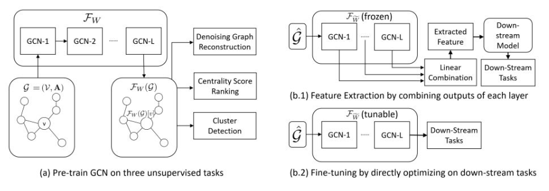

# GNN 教程：GCN 的无监督预训练

## 一、引言

在前面的文章中，我们分别介绍了[基本的图神经网络算法 GCN](https://archwalker.github.io/blog/2019/06/01/GNN-Triplets-GCN.html)、为了解决图中存在的超级节点问题而使用采样和聚类构建的 inductive learning 框架 [GraphSAGE](https://archwalker.github.io/blog/2019/06/01/GNN-Triplets-GraphSAGE.html)、为了处理图数据中所存在的噪声问题而引入“注意力”机制(attention mechanism)的[图注意力网络（Graph Attention Networks，GAT）](https://archwalker.github.io/blog/2019/06/01/GNN-Triplets-GAT.html)，并且为了介绍经典的 GCN 逐层传播公式是如何从谱图卷积推导而来而对[谱图理论和GCN的起源](https://archwalker.github.io/blog/2019/06/16/GNN-Spectral-Graph.html)进行讨论。同时，由于 GNN 模型越来越受到学术研究的广泛关注，导致我们开始思考“[GNN模型有多强？](https://archwalker.github.io/blog/2019/06/22/GNN-Theory-Power.html)”问题。

GCN 模型以及其变体也被证明在图结构数据建模应用方面的成功，然而， 由于 GCN 模型和深度神经网络一样包含大量的模型参数，导致如果想要训练一个更加准确的 GCN 模型，我们就需要一个带有标注的大规模数据集或者表征学习，但是这个要求是不太合理的，因为特征工程需要消耗大量的人力资源。

最近，预训练语言模型（eg：[BERT(Devlin et al., 2018)](https://arxiv.org/abs/1810.04805)）和图像编码器（eg：[VGG Nets (Girshick et al., 2014)](http://fcv2011.ulsan.ac.kr/files/announcement/513/r-cnn-cvpr.pdf)）等学习输入数据的通用表征编码器的被提出，这些编码器最大特点是能够为模型参数提供更加强大的初始化参数，并提高下游任务的性能。由于这些预训练模型能够从未标注的语料库或者相关任务数据中进行表征学习，因此这些预训练模型有效地减低了训练一个准确的模型所需要的带标注数据和特征成本。

这也让更多的研究者思考以下两个问题：

1. GCNs 是否能够从无监督预训练中受益？
2. 哪一种无监督任务能够被用于预训练 GCN 当中？
   
针对上述问题，我们将会向大家介绍一种 GCN 的无监督预训练模型，该模型不仅能够捕获未标注图数据中通用的结构信息，同时，通过在较低资源环境中提供有用的表征信息或者参数来提高 GCN 下游任务的性能。

## 二、GCN 的无监督预训练模型框架介绍

如下图所示，事实上预训练模型需要捕捉图中与任务无关的结构信息。基于该原则，首先需要从以下三种带有不同层次属性的无监督任务中研究预训练模型：

- 去噪图重建：通过掩盖一些边的方式产生携带噪声的图；
- 中心节点分数排名：通过对每一个节点计算不同的中心节点分数，其中，包括：PageRank, Betweenness and Closeness；然后，通过这些分数训练 GCNs 并对节点进行排序；
- 图簇检测：首先，使用 [Clauset-Newman-Moore algorithm  (Clauset et al., 2004)](https://journals.aps.org/pre/abstract/10.1103/PhysRevE.70.066111) 检测图簇，然后训练 GCNs 以保留这些簇的节点特征表示。 

这三个任务从局部到全局上反映出图结构信息的不同属性。

然后，通过从预训练到下游任务的方式研究迁移图结构学习中两种广泛使用的应用方法：

- 特征抽取；
- 微调以及根据经验比较模型性能。

> 图注：预训练和应用于 GCN 的整体框架

### 2.1 无监督的预训练任务

#### 任务 1：去噪图重建

任务 1 的思路是这样的，首先将噪声添加到输入图 $G$ ，然后随机地删除输入图 $G$ 中一些现有边以获得其噪声图 $\mathcal{G}^*$，接下去GCN 模型 $\mathcal{F}_W$ 学习所生成的噪声图 $\mathcal{G}^*$ 中的表征信息，最后，将 GCN 模型 $\mathcal{F}_W$ 学习到的表征信息输入 [neural tensor network (Socher et al. (2013))](https://cs.stanford.edu/~danqi/papers/nips2013.pdf) $\mathcal{D}_{\text { denoise }}$，其主要利用以下的公式判断两个节点是否连接：

$$
\hat{\mathbf{A}}_{u, v}=\mathcal{D}_{d e n o i s e}\left(\mathcal{F}_{W}\left(\mathcal{G}^{*}\right)[u], \mathcal{F}_{W}\left(\mathcal{G}^{*}\right)[v]\right)
$$

其中，$\mathcal{F}_W$ 和 $\mathcal{D}_{\text { denoise }}$ 采用二元交叉熵损失函数进行共同优化：

$$
\mathcal{L}_{\text {denoise}}=-\sum_{u, v \in \mathcal{V}}\left(\mathbf{A}_{u, v} \log \left(\hat{\mathbf{A}}_{u, v}\right)+\left(1-\mathbf{A}_{u, v}\right) \log \left(1-\hat{\mathbf{A}}_{u, v}\right)\right)
$$

> 在这里做一个小结，通过去噪图重建任务，预训练 $\mathcal{F}_W$ 能够学习健全的表征信息以更好的保存局部图结构，该图结构对于不完整或噪声图更有效。

#### 任务 2：中心性分数排名

作为图的重要指标之一，中心性分数能够根据整个图中的结构角色来衡量节点的重要性。预训练 GCN $\mathcal{F}_W$ 根据其中心性分数对节点进行排序，以便 $\mathcal{F}_W$ 能够捕获每个节点的结构角色。中心性分数采用以下三种方式进行计算：

1. [PageRank (Page et al., 1999)](http://ilpubs.stanford.edu:8090/422) 基于分数更高的节点对邻居节点贡献越大的思想来测量节点的影响程度，他描述在整个图中的'hub'角色；
2. [Betweenness (Freeman, 1977)](https://www.jstor.org/stable/3033543) 测量节点位于其他节点之间的最短路径上的次数，他描述了在整个图中的 'bridge' 角色；
3. [Closeness (Sabidussi, 1966)](http://www.springerlink.com/index/u57264845r413784.pdf) 测量节点与其他节点间的最短路径的总长度，他描述了在整个图中的 'broadcaster' 角色。

以上三种中心性分数计算方式表现了一个节点在整个图中所承担的不同角色，也就是通过这三种中心性分数能够获取图中节点的全局信息。

但是，由于中心性得分在不同尺度的不同图间无可比性，因此，需要利用相同图中关于中心性得分的节点的相对次序。

也就是，对于节点对 $(i, j)$ 和中心性分数 $s$，带有相对次序作为 $\mathbf{O}_{u, v}^s=\left(s_u>s_v\right)$，解码器 $\mathcal{D}_{\operatorname{rank}}^s$ 通过 $\hat{S}_v=\mathcal{D}_{r a n k}^s\left(\mathcal{F}_W(\mathcal{G})[v]\right)$ 估计排序分数。

通过利用[(Burges et al., 2005)](https://icml.cc/2015/wp-content/uploads/2015/06/icml_ranking.pdf)所定义的成对排序方法，并由以下公式估计排名的概率：

$$
\hat{\mathbf{O}}_{u, v}^{s}=\frac{\exp \left(\hat{S}_u-\hat{S}_v\right)}{1+\exp \left(\hat{S}_u-\hat{S}_v\right)}
$$

所以，我们对每一个中心性分数$s$优化 $\mathcal{F}_W$ 和 $\mathcal{D}_{\operatorname{rank}}^s$：

$$
\mathcal{L}_{r a n k}=-\sum_s \sum_{u, v \in \mathcal{V}}\left(\mathbf{O}_{u, v}^s \log \left(\hat{\mathbf{O}}_{u, v}^s\right)+\left(1-\mathbf{O}_{u, v}^s\right) \log \left(1-\hat{\mathbf{O}}_{u, v}^s\right)\right)
$$

> 在这里做一个小结，通过中心性分数排名任务，预训练$\mathcal{F}_{\overline{W}}$能够学习在这个图中的每一个节点的全局信息。

#### 任务 3：图簇检测

作为图的重要指标之一，图簇结构能够将图中不同的节点分组到不同的簇中，使得簇内部节点的连接更加密集，簇间的节点连接稀疏。

为了进行图簇检测，我们利用 基于贪心算法的[Clauset-Newman-Moore 算法(Clauset et al. (2004))](http://ece-research.unm.edu/ifis/papers/community-moore.pdf) 来进行最大化聚类。

该算法能够将图中的节点分组到$K$个不同的非重叠的簇中：

$$
\mathcal{C}=\left\{C_i | \overline{C}_i \subset \mathcal{V}, C_i \cap C_j^-=\emptyset\right\}_{i=1}^K
$$

同时，采用一套指标函数 $\left\{\mathbf{I}_c(\cdot) | C \in \mathcal{C}\right\}$ 来区分给定节点是否属于簇 $C$。

预训练 GCN 学习簇能够轻易检测到的节点表示。该思路是这样的，首先，通过 $\mathcal{A}\left(\left\{\mathcal{F}_W(\mathcal{G})[v] | v \in C\right\}\right)$ 使用一个基于注意力的聚类器 $A$ 来给定簇表示；然后，通过 $\hat{\mathbf{I}}_C(v)=\mathcal{D}_{\text {cluster}}\left(\mathcal{F}_W(\mathcal{G})[v], \mathcal{A}\left(\left\{\mathcal{F}_W(\mathcal{G})[v] | v \in C\right\}\right)\right)$，解码器 $\mathcal{D}_{\text { cluster }}$ 评估节点 $v$属于簇$C$的概率，并通过以下方法进行对 $\mathcal{F}_W$ 和 $\mathcal{D}_{\text {cluster}}$ 进行优化：

$$
\mathcal{L}_{\text {cluster}}=-\sum_{C \in \mathcal{C}} \sum_{v \in \mathcal{V}}\left(\mathbf{I}_C(v) \log \left(\hat{\mathbf{I}}_C(v)\right)\right)
$$

> 在这里做一个小结，通过图簇检测任务，预训练模型 $\mathcal{F}_{\overline{W}}$ 能够学习将图中的节点嵌入到可以保存簇学习的表示空间中，使其能够轻易被检测到。

#### 本节小结

 在此做一个小结，在 2.1 节中，在去噪图重建、计算中心性分数排名、图簇检测三种带有不同层次属性的无监督任务中训练预训练模型，能够让预训练模型捕捉图中与任务无关的结构信息，以从局部到全局上反映出图结构信息的不同属性。

### 2.2 无监督的预训练任务

通过上面所提到的带有 $\mathcal{L}_{\text {denoise}}$ 、$\mathcal{L}_{\operatorname{rank}}$ 和 $\mathcal{L}_{\text {cluster}}$ 的三种任务上的预训练 $\mathcal{F}_W$，预训练 $\mathcal{F}_{\widetilde{W}}$ 能够捕获任意给定图的通用结构信息。接下去，我们将介绍如何将预训练 $\mathcal{F}_{\widetilde{W}}$ 应用于新任务，如下图所示：

1. 特征提取（Feature Extraction, FE）：利用加权聚合的方法集合每个 GCN 层的节点表征信息，然后将提取的表征信息输入到另一个特定任务的 GCN 中，进行重新训练。
2. 微调（Fine Tuning，FT)）：通过在预训练模型之上添加一个与下游任务相关的 输出层，并在特定任务中进行微调。

#### 本节小结

 在此做一个小结，利用 2.1 节所提到方法预训练模型，使预训练模型能够从局部到全局上捕获图结构信息的不同属性，然后将预训练模型在特定的任务中做微调，最终应用于该特定任务中。煮个栗子，2.1 节所提到的训练预训练模型过程好比我们在高中阶段所学习的语、数、英、物、化、生等基础学科，主要用于夯实基础知识；而预训练模型在特定任务中的特征提取和微调过程就相当于我们在大学期间基于已有的基础知识，针对所选专业进行进一步强化，从而获得能够应用于实际场景的作用技能。

 ## 后记

 本篇博文重点介绍了 GNN 的无监督预训练模型，该模型不仅能够捕获未标注图数据中通用的结构信息，同时，通过在较低资源环境中提供有用的表征信息或者参数来提高 GCN 下游任务的性能。到目前为止，我们介绍了图神经网络的三个基本模型，GCN、GraphSAGE、GAT；介绍了图卷积神经网络和谱图卷积的关系；介绍了图神经网络模型的表达能力；介绍了图神经网络的无监督训练模型。接下去，我们将介绍。。。

